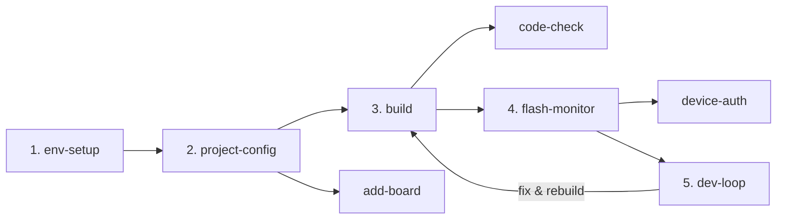

# TuyaOpen Dev Skills

[](LICENSE)
[](https://github.com/tuya/TuyaOpen)

**English** | [中文](README_zh.md)

---

AI-powered development skills for building [TuyaOpen](https://github.com/tuya/TuyaOpen) hardware projects faster with [Cursor IDE](https://cursor.com). Each skill teaches the AI assistant how to handle a specific part of the TuyaOpen development workflow — from environment setup to device debugging.

## What Are Skills?

Skills are structured knowledge files (`SKILL.md`) that give AI coding assistants deep, contextual understanding of specific tools, frameworks, and workflows. When loaded into Cursor IDE, the assistant can:

- Set up the TuyaOpen development environment automatically
- Build, flash, and monitor firmware with correct parameters
- Navigate Kconfig dependencies and board configurations
- Diagnose device errors from serial logs
- Follow TuyaOpen coding standards and security practices

## Skill List

| Skill | Directory | Description |
|-------|-----------|-------------|
| **Environment Setup** | [`tuyaopen-env-setup`](skills/tuyaopen-env-setup/) | Install dependencies, activate `export.sh`, verify toolchain |
| **Build** | [`tuyaopen-build`](skills/tuyaopen-build/) | Compile projects, configure Kconfig options, resolve dependency chains |
| **Project & Config** | [`tuyaopen-project-config`](skills/tuyaopen-project-config/) | Create new projects/boards/platforms, manage build configurations |
| **Code Check** | [`tuyaopen-code-check`](skills/tuyaopen-code-check/) | Validate formatting (clang-format), file headers, no Chinese characters |
| **Flash & Monitor** | [`tuyaopen-flash-monitor`](skills/tuyaopen-flash-monitor/) | Flash firmware, view serial logs, handle dual-port chips |
| **Add Board** | [`tuyaopen-add-board`](skills/tuyaopen-add-board/) | Add new board BSP: Kconfig, drivers, pin config, layer rules |
| **Dev Loop** | [`tuyaopen-dev-loop`](skills/tuyaopen-dev-loop/) | Build-flash-monitor-analyze iteration cycle, error code lookup |
| **Device Auth** | [`tuyaopen-device-auth`](skills/tuyaopen-device-auth/) | Configure UUID/AuthKey/PID, serial authorization, network provisioning |
| **Agent hardware debug helper** | [`agent-hardware-debug-helper-tools`](skills/agent-hardware-debug-helper-tools/) | `agent_target_tool.py`: USB discovery, background logging, optional UART CLI (if firmware exposes it), `tos.py` wrappers |

## Development Workflow

The skills cover the complete TuyaOpen development lifecycle:



**Typical flow:** Set up environment → Create/configure project → Build → Flash to device → Monitor logs → Analyze & iterate.

## Supported Platforms

| Platform | Chips |
|----------|-------|
| T5AI | T5AI series |
| ESP32 | ESP32, ESP32-S3, ESP32-C3, ESP32-C6 |
| LINUX | Ubuntu, Raspberry Pi, DshanPi |
| T2 | T2-U |
| T3 | T3 LCD Devkit |
| LN882H | LN882H, EWT103-W15 |
| BK7231X | BK7231X |

## Installation

Cursor automatically loads skills from the following directories:

| Location | Scope |
|----------|-------|
| `.agents/skills/` | Project |
| `.cursor/skills/` | Project |
| `~/.cursor/skills/` | User (global) |

### Option A: Instruct the agent to install the skill (Recommended)

```text
Install the skill for this project: https://github.com/tuya/TuyaOpen-dev-skills.git
```

### Option B: Copy into your TuyaOpen project

Copy the `skills/` directory into your TuyaOpen project as `.agents/skills/`:

```bash
git clone https://github.com/tuya/TuyaOpen-dev-skills.git
mkdir -p /path/to/TuyaOpen/.agents/skills
cp -r TuyaOpen-dev-skills/skills/* /path/to/TuyaOpen/.agents/skills/
```

### Option C: Symlink

Create a symbolic link so skills stay in sync with this repo:

```bash
git clone https://github.com/tuya/TuyaOpen-dev-skills.git
mkdir -p /path/to/TuyaOpen/.agents
ln -s /path/to/TuyaOpen-dev-skills/skills/ /path/to/TuyaOpen/.agents/skills
```

### Option D: Pick individual skills

Copy only the skills you need:

```bash
mkdir -p /path/to/TuyaOpen/.agents/skills/
cp -r TuyaOpen-dev-skills/skills/tuyaopen-build/ /path/to/TuyaOpen/.agents/skills/
cp -r TuyaOpen-dev-skills/skills/tuyaopen-env-setup/ /path/to/TuyaOpen/.agents/skills/
```

## Project Structure

```
TuyaOpen-dev-skills/
├── README.md
├── README_zh.md
├── LICENSE
└── skills/
    ├── tuyaopen-env-setup/
    │   ├── SKILL.md
    │   └── scripts/check_env.sh
    ├── tuyaopen-build/
    │   ├── SKILL.md
    │   └── references/KCONFIG_GUIDE.md
    ├── tuyaopen-project-config/
    │   ├── SKILL.md
    │   └── references/TOS_COMMANDS.md
    ├── tuyaopen-code-check/
    │   ├── SKILL.md
    │   └── scripts/check_files.sh
    ├── tuyaopen-flash-monitor/
    │   └── SKILL.md
    ├── tuyaopen-add-board/
    │   ├── SKILL.md
    │   └── references/BOARD_LAYERS.md
    ├── tuyaopen-dev-loop/
    │   ├── SKILL.md
    │   ├── scripts/build_run_linux.sh
    │   └── references/ERROR_CODES.md
    ├── tuyaopen-device-auth/
    │   ├── SKILL.md
    │   └── references/PROVISIONING.md
    └── agent-hardware-debug-helper-tools/
        ├── SKILL.md
        ├── agent_target_tool.py
        ├── agent_target_tool_requirements.txt
        └── tests/test_agent_target_tool.py
```

Each skill follows the [Agent Skills](https://agentskills.io/) standard:
- `SKILL.md` — concise core instructions loaded automatically by the agent
- `references/` — detailed documentation loaded on demand for context efficiency
- `scripts/` — executable scripts the agent can run directly

## Related Resources

- [TuyaOpen](https://github.com/tuya/TuyaOpen) — Main SDK repository
- [TuyaOpen Documentation](https://tuyaopen.ai/docs/quick-start) — Official docs
- [Tuya IoT Platform](https://platform.tuya.com) — Cloud platform for device management
- [Cursor IDE](https://cursor.com) — AI-powered code editor

## Contributing

Contributions are welcome! To add or improve a skill:

1. Fork this repository
2. Edit or create a `SKILL.md` in `skills/<skill-name>/`
3. Follow the YAML front-matter format (`name`, `description`, `license`, `compatibility`)
4. Keep `SKILL.md` concise — move detailed reference material to `references/`
5. Add agent-executable scripts to `scripts/` when automatable workflows exist
6. Submit a Pull Request

## License

This project is licensed under the [Apache License 2.0](LICENSE).
