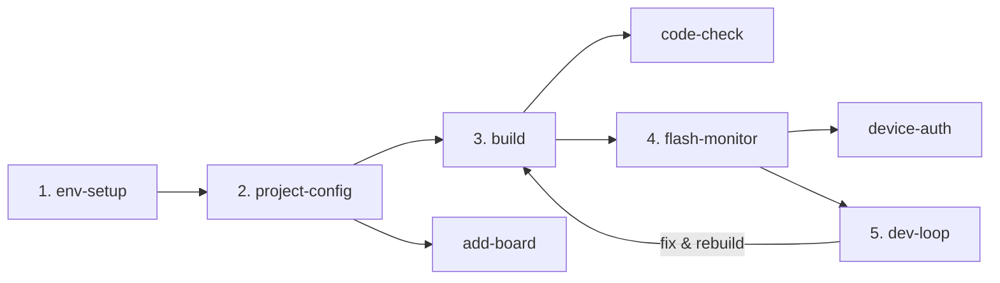

# TuyaOpen Dev Skills

[](LICENSE)
[](https://github.com/tuya/TuyaOpen)

**English** | [中文](README_zh.md)

---

AI-powered development skills for building [TuyaOpen](https://github.com/tuya/TuyaOpen) hardware projects faster with [Cursor IDE](https://cursor.com). Each skill teaches the AI assistant how to handle a specific part of the TuyaOpen development workflow — from environment setup to device debugging.

## What Are Skills?

Skills are structured knowledge files (`SKILL.md`) that give AI coding assistants deep, contextual understanding of specific tools, frameworks, and workflows. When loaded into Cursor IDE, the assistant can:

- Set up the TuyaOpen development environment automatically
- Build, flash, and monitor firmware with correct parameters
- Navigate Kconfig dependencies and board configurations
- Diagnose device errors from serial logs
- Follow TuyaOpen coding standards and security practices

## Skill List

| Skill | Directory | Description |
|-------|-----------|-------------|
| **Environment Setup** | [`tuyaopen/env-setup`](skills/tuyaopen/env-setup/) | Install dependencies, activate environment (Linux/macOS/Windows) |
| **Build** | [`tuyaopen/build`](skills/tuyaopen/build/) | Compile projects, configure Kconfig options |
| **Project & Config** | [`tuyaopen/project-config`](skills/tuyaopen/project-config/) | Create new projects, manage build configurations |
| **Code Check** | [`tuyaopen/code-check`](skills/tuyaopen/code-check/) | Validate formatting, file headers, no Chinese characters |
| **Add Board** | [`tuyaopen/add-board`](skills/tuyaopen/add-board/) | Add new board BSP: Kconfig, drivers, pin config |
| **Dev Loop** | [`tuyaopen/dev-loop`](skills/tuyaopen/dev-loop/) | Build→flash→monitor→analyze iteration cycle |
| **Device Auth** | [`tuyaopen/device-auth`](skills/tuyaopen/device-auth/) | Write UUID/AuthKey/PID to device (source code or serial KV flash) |
| **Debug Helper** | [`tuyaopen/debug-helper`](skills/tuyaopen/debug-helper/) | Non-blocking background serial log capture for agents |

## Development Workflow

The skills cover the complete TuyaOpen development lifecycle:


```mermaid
flowchart LR
    envSetup["1. env-setup"] --> projectConfig["2. project-config"]
    projectConfig --> build["3. build"]
    build --> codeCheck["code-check"]
    build --> flashMonitor["4. flash-monitor"]
    flashMonitor --> deviceAuth["device-auth"]
    flashMonitor --> devLoop["5. dev-loop"]
    devLoop -->|"fix & rebuild"| build
    projectConfig --> addBoard["add-board"]
```

**Typical flow:** Set up environment → Create/configure project → Build → Flash to device → Monitor logs → Analyze & iterate.

## Supported Platforms

| Platform | Chips |
|----------|-------|
| T5AI | T5AI series |
| ESP32 | ESP32, ESP32-S3, ESP32-C3, ESP32-C6 |
| LINUX | Ubuntu, Raspberry Pi, DshanPi |
| T2 | T2-U |
| T3 | T3 LCD Devkit |
| LN882H | LN882H, EWT103-W15 |
| BK7231X | BK7231X |

## Installation

Cursor automatically loads skills from the following directories:

| Location | Scope |
|----------|-------|
| `.agents/skills/` | Project |
| `.cursor/skills/` | Project |
| `~/.cursor/skills/` | User (global) |

### Option A: Instruct the agent to install the skill (Recommended)

```text
Install the skill for this project: https://github.com/tuya/TuyaOpen-dev-skills.git
```

### Option B: Copy into your TuyaOpen project

Copy the `skills/tuyaopen` directory into your TuyaOpen project as `.agents/skills/`:

```bash
git clone https://github.com/tuya/TuyaOpen-dev-skills.git
mkdir -p /path/to/TuyaOpen/.agents/skills
cp -r TuyaOpen-dev-skills/skills/tuyaopen /path/to/TuyaOpen/.agents/skills/tuyaopen
```

### Option C: Symlink

Create a symbolic link so skills stay in sync with this repo:

```bash
git clone https://github.com/tuya/TuyaOpen-dev-skills.git
mkdir -p /path/to/TuyaOpen/.agents
ln -s /path/to/TuyaOpen-dev-skills/skills/tuyaopen/ /path/to/TuyaOpen/.agents/skills/tuyaopen
```

### Option D: Pick individual skills

Copy only the skills you need:

```bash
mkdir -p /path/to/TuyaOpen/.agents/skills/tuyaopen
cp -r TuyaOpen-dev-skills/skills/tuyaopen/build/ /path/to/TuyaOpen/.agents/skills/tuyaopen/
cp -r TuyaOpen-dev-skills/skills/tuyaopen/env-setup/ /path/to/TuyaOpen/.agents/skills/tuyaopen/
```

## Project Structure

```
TuyaOpen-dev-skills/
├── README.md
├── README_zh.md
├── LICENSE
└── skills/
    └── tuyaopen/
        ├── env-setup/        SKILL.md + scripts/{check_env.sh,.bat,.ps1}
        ├── build/            SKILL.md + references/KCONFIG_GUIDE.md
        ├── project-config/   SKILL.md + references/TOS_COMMANDS.md
        ├── code-check/       SKILL.md + scripts/check_files.py
        ├── add-board/        SKILL.md + references/BOARD_LAYERS.md
        ├── dev-loop/         SKILL.md + scripts/build_run.py + references/ERROR_CODES.md
        ├── device-auth/      SKILL.md + references/PROVISIONING.md
        └── debug-helper/     SKILL.md + scripts/monitor_helper.py
```

Each skill follows the [Agent Skills](https://agentskills.io/) standard:
- `SKILL.md` — concise core instructions loaded automatically by the agent
- `references/` — detailed documentation loaded on demand for context efficiency
- `scripts/` — executable scripts the agent can run directly

## Related Resources

- [TuyaOpen](https://github.com/tuya/TuyaOpen) — Main SDK repository
- [TuyaOpen Documentation](https://tuyaopen.ai/docs/quick-start) — Official docs
- [Tuya IoT Platform](https://platform.tuya.com) — Cloud platform for device management
- [Cursor IDE](https://cursor.com) — AI-powered code editor

## Contributing

Contributions are welcome! To add or improve a skill:

1. Fork this repository
2. Edit or create a `SKILL.md` in `skills/<skill-name>/`
3. Follow the YAML front-matter format (`name`, `description`, `license`, `compatibility`)
4. Keep `SKILL.md` concise — move detailed reference material to `references/`
5. Add agent-executable scripts to `scripts/` when automatable workflows exist
6. Submit a Pull Request

## License

This project is licensed under the [Apache License 2.0](LICENSE).
