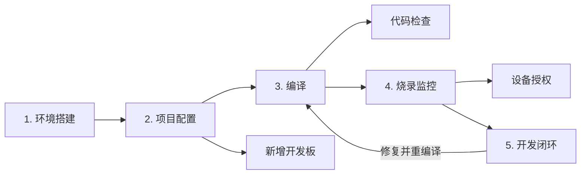

# TuyaOpen 开发技能包

[](LICENSE)
[](https://github.com/tuya/TuyaOpen)

[English](README.md) | **中文**

---

面向 [TuyaOpen](https://github.com/tuya/TuyaOpen) 硬件开发的 AI 开发技能包，配合 [Cursor IDE](https://cursor.com) 使用，让 AI 助手深度理解 TuyaOpen 开发流程，加速从环境搭建到设备调试的全过程。

## 什么是 Skills？

Skills 是结构化的知识文件（`SKILL.md`），为 AI 编程助手提供特定工具、框架和工作流的深度上下文理解。加载到 Cursor IDE 后，AI 助手可以：

- 自动搭建 TuyaOpen 开发环境
- 使用正确的参数编译、烧录、监控固件
- 理解 Kconfig 依赖关系和开发板配置
- 从串口日志诊断设备错误
- 遵循 TuyaOpen 编码规范和安全实践

## 技能列表

| 技能 | 目录 | 说明 |
|------|------|------|
| **环境搭建** | [`tuyaopen-env-setup`](skills/tuyaopen-env-setup/) | 安装依赖、激活 `export.sh`、验证工具链 |
| **项目编译** | [`tuyaopen-build`](skills/tuyaopen-build/) | 编译项目、配置 Kconfig 选项、解析依赖链 |
| **项目与配置管理** | [`tuyaopen-project-config`](skills/tuyaopen-project-config/) | 创建新项目/开发板/平台、管理编译配置 |
| **代码检查** | [`tuyaopen-code-check`](skills/tuyaopen-code-check/) | 格式校验（clang-format）、文件头检查、禁止中文字符 |
| **烧录与监控** | [`tuyaopen-flash-monitor`](skills/tuyaopen-flash-monitor/) | 烧录固件、查看串口日志、处理双串口芯片 |
| **新增开发板** | [`tuyaopen-add-board`](skills/tuyaopen-add-board/) | 添加开发板 BSP：Kconfig、驱动、引脚配置、层级规则 |
| **开发闭环** | [`tuyaopen-dev-loop`](skills/tuyaopen-dev-loop/) | 构建-烧录-监控-分析的迭代循环、错误码查询 |
| **设备授权** | [`tuyaopen-device-auth`](skills/tuyaopen-device-auth/) | 配置 UUID/AuthKey/PID、串口授权、网络配网 |
| **Agent 硬件调试助手** | [`agent-hardware-debug-helper-tools`](skills/agent-hardware-debug-helper-tools/) | `agent_target_tool.py`：USB 枚举、后台日志、可选 UART CLI（固件支持时）、`tos.py` 封装 |

## 开发流程

技能包覆盖完整的 TuyaOpen 开发生命周期：



**典型流程：** 搭建环境 → 创建/配置项目 → 编译 → 烧录到设备 → 监控日志 → 分析并迭代。

## 支持的平台

| 平台 | 芯片 |
|------|------|
| T5AI | T5AI 系列 |
| ESP32 | ESP32, ESP32-S3, ESP32-C3, ESP32-C6 |
| LINUX | Ubuntu, Raspberry Pi, DshanPi |
| T2 | T2-U |
| T3 | T3 LCD Devkit |
| LN882H | LN882H, EWT103-W15 |
| BK7231X | BK7231X |

## 安装方法

Cursor 会自动从以下目录加载技能：

| 位置 | 作用域 |
|------|--------|
| `.agents/skills/` | 项目级 |
| `.cursor/skills/` | 项目级 |
| `~/.cursor/skills/` | 用户级（全局） |

### 方式 A：在 Cursor 中从 GitHub 安装（推荐）

无需手动克隆，直接从 GitHub 仓库导入技能：

1. 打开 **Cursor Settings**（Linux/Windows: Ctrl+Shift+J，Mac: Cmd+Shift+J）
2. 前往 **Rules**
3. 在 **Project Rules** 部分，点击 **Add Rule**
4. 选择 **Remote Rule (Github)**
5. 输入：`https://github.com/tuya/TuyaOpen-dev-skills.git`


Cursor 会自动拉取并保持技能同步。

### 方式 B：复制到 TuyaOpen 项目

将 `skills/` 目录复制到 TuyaOpen 项目的 `.agents/skills/` 下：

```bash
git clone https://github.com/tuya/TuyaOpen-dev-skills.git
mkdir -p /path/to/TuyaOpen/.agents/skills
cp -r TuyaOpen-dev-skills/skills/* /path/to/TuyaOpen/.agents/skills/
```

### 方式 C：符号链接

创建符号链接，让技能包与本仓库保持同步：

```bash
git clone https://github.com/tuya/TuyaOpen-dev-skills.git
mkdir -p /path/to/TuyaOpen/.agents
ln -s /path/to/TuyaOpen-dev-skills/skills/ /path/to/TuyaOpen/.agents/skills
```

### 方式 D：按需选择

只复制你需要的技能：

```bash
mkdir -p /path/to/TuyaOpen/.agents/skills/
cp -r TuyaOpen-dev-skills/skills/tuyaopen-build/ /path/to/TuyaOpen/.agents/skills/
cp -r TuyaOpen-dev-skills/skills/tuyaopen-env-setup/ /path/to/TuyaOpen/.agents/skills/
```

## 项目结构

```
TuyaOpen-dev-skills/
├── README.md
├── README_zh.md
├── LICENSE
└── skills/
    ├── tuyaopen-env-setup/
    │   ├── SKILL.md
    │   └── scripts/check_env.sh
    ├── tuyaopen-build/
    │   ├── SKILL.md
    │   └── references/KCONFIG_GUIDE.md
    ├── tuyaopen-project-config/
    │   ├── SKILL.md
    │   └── references/TOS_COMMANDS.md
    ├── tuyaopen-code-check/
    │   ├── SKILL.md
    │   └── scripts/check_files.sh
    ├── tuyaopen-flash-monitor/
    │   └── SKILL.md
    ├── tuyaopen-add-board/
    │   ├── SKILL.md
    │   └── references/BOARD_LAYERS.md
    ├── tuyaopen-dev-loop/
    │   ├── SKILL.md
    │   ├── scripts/build_run_linux.sh
    │   └── references/ERROR_CODES.md
    ├── tuyaopen-device-auth/
    │   ├── SKILL.md
    │   └── references/PROVISIONING.md
    └── agent-hardware-debug-helper-tools/
        ├── SKILL.md
        ├── agent_target_tool.py
        ├── agent_target_tool_requirements.txt
        └── tests/test_agent_target_tool.py
```

每个技能遵循 [Agent Skills](https://agentskills.io/) 开放标准：
- `SKILL.md` — 简洁的核心指令，由 Agent 自动加载
- `references/` — 详细参考文档，按需加载以节省上下文
- `scripts/` — Agent 可直接执行的脚本

## 相关资源

- [TuyaOpen](https://github.com/tuya/TuyaOpen) — SDK 主仓库
- [TuyaOpen 文档](https://tuyaopen.ai/docs/quick-start) — 官方文档
- [涂鸦 IoT 平台](https://platform.tuya.com) — 设备管理云平台
- [Cursor IDE](https://cursor.com) — AI 驱动的代码编辑器

## 参与贡献

欢迎贡献！添加或改进技能的步骤：

1. Fork 本仓库
2. 在 `skills/<技能名>/` 下编辑或创建 `SKILL.md`
3. 遵循 YAML front-matter 格式（`name`、`description`、`license`、`compatibility`）
4. 保持 `SKILL.md` 简洁——将详细参考资料放到 `references/` 目录
5. 如有可自动化的工作流，将可执行脚本放到 `scripts/` 目录
6. 提交 Pull Request

## 许可证

本项目采用 [Apache License 2.0](LICENSE) 开源协议。
